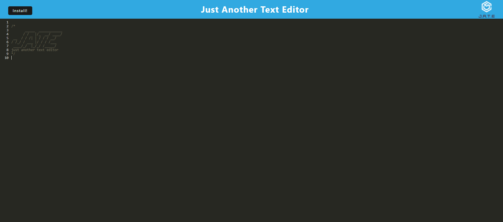

# J.A.T.E - Just Another Text Editor

## Description

J.A.T.E, also known as Just Another Text Editor, is just another text editor. It is built as a PWA site that allows for users to install it to act similar to a 'native' application. It is built using starter code with the addition of using IndexedDB database and Service Worker to have the full functionality of a PWA site. 

## Table of Contents
- [Installation](#installation)
- [Usage](#usage)
- [License](#license)
- [Credit](#credit)
- [Questions](#questions)

## Installation

If you wish to run the application locally, please cloning the git repository and run the following commands in the root folder to install all necessary packages in all folders:

`npm install`

This will download all necessary npm packages in both server and client side. Once installed please make sure to run the build for client side:

`npm run build`

This will allow for the webpack to run and create the dist folder for the PWA to function properly.

From there follow the [usage](#usage) instructions to run the application.

## Usage 

**It is IMPORTANT that you clear your cache before running this application or it may not run properly**

To run the application please make sure to run this command in the terminal:

`npm run start`

This will run the application and open it in a localhost port where you'll see J.A.T.E and be able to type in whatever you wish.

If you do not wish to run the application locally, you may access the website through the deployed link here: [J.A.T.E](https://am-text-editor-73ddffeb5eae.herokuapp.com/)

## License

This is licensed under MIT. Please check the LICENSE document to know more.

## Credit

Starter code provided by University of Texas Coding Bootcamp.

## Questions

If you have any questions, feel free to reach me at [GitHub](https://github.com/Annie-McElroy) or via email at [annie.mcelroy8522@gmail.com](annie.mcelroy8522@gmail.com).